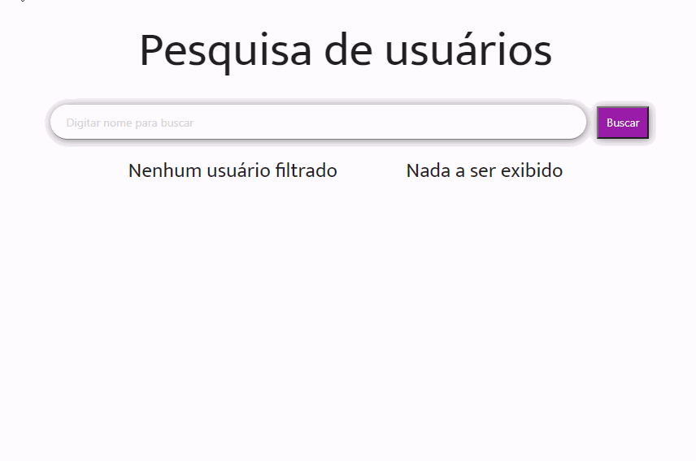

<h2>Filtro de nomes</h2>

Meu primeiro app de buscar =)

- JavaScript Moderno puro
- Organização do código em funções
- Código auto-documentado
- Utilização de fetch com async/await
- Utilização de template literals
- Reduce, forEach, find, filter
- Lista em ordem alfabética

Link: https://robertarfa.github.io/filter_list/

